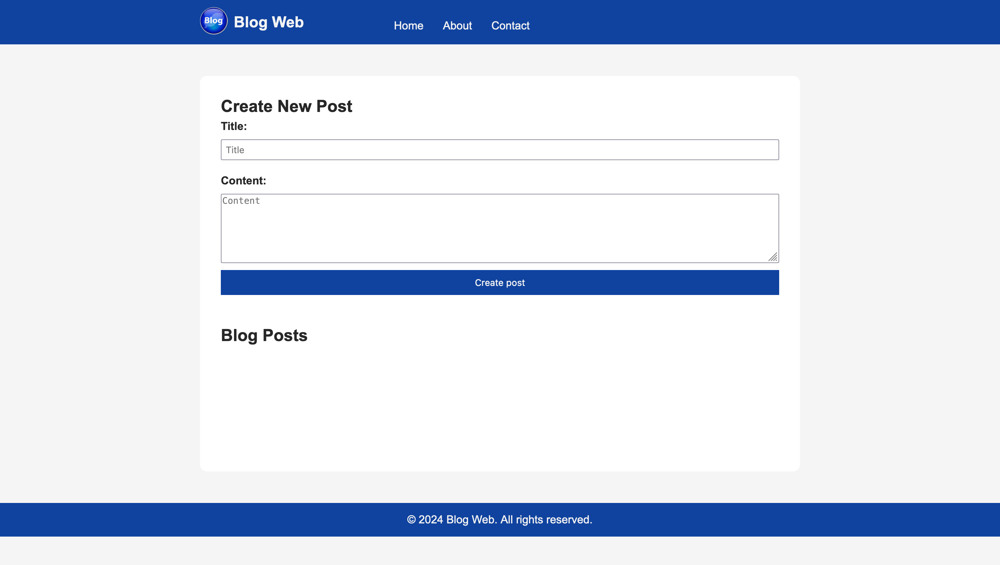

# Simple Blog Web

A simple blog application built using JavaScript, Node.js, Express.js, and EJS.

## Table of Contents

- [Technologies Used](#technologies_used)
- [Features](#features)
- [Installation](#installation)
- [Usage](#usage)
- [Contributing](#contributing)
- [License](#license)

## Technologies Used

- JavaScript
- Node.js
- Express.js
- EJS (Embedded JavaScript)

## Features

- **Create Post**: Users can create new blog posts with a title and content.
- **Edit Post**: Edit existing posts with updated titles and content.
- **Delete Post**: Remove unwanted posts from the blog.
- **Homepage**: Displays all existing blog posts with options to edit or delete.

## Installation

1. Clone the repository: git clone https://github.com/Damilordz/blog_web.git

2. Navigate to the project directory: cd blog_web

3. Install dependencies: npm install

## Usage

1. Start the server: node app.js

2. Open your web browser and go to [http://localhost:3000/](http://localhost:3000/) to access the application.

3. Create, edit, or delete posts as needed.

## Contributing

Contributions are welcome! If you have any ideas for improvements or find any issues, please open an issue or submit a pull request.

1. Fork the repository.
2. Create your feature branch: git checkout -b feature-name
3. Commit your changes: git commit -am 'Add some feature'
4. Push to the branch: git push origin feature-name
5. Submit a pull request.
